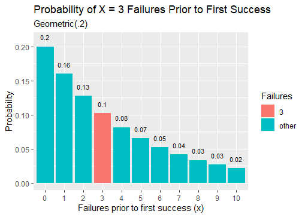
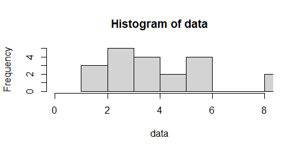
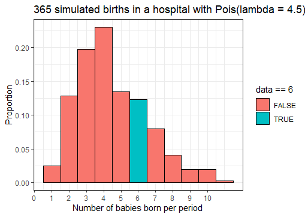
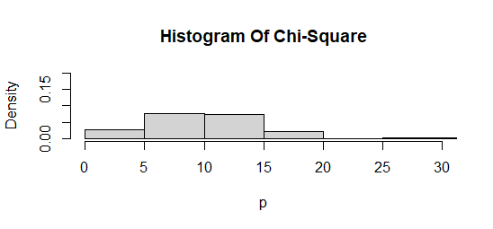
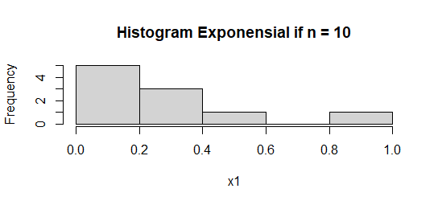
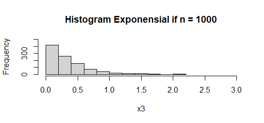
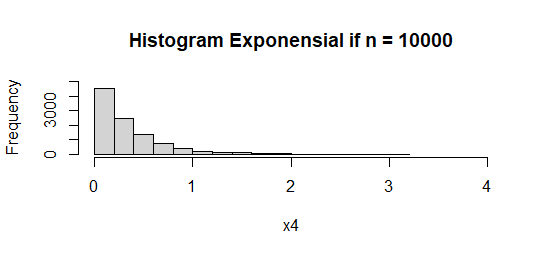
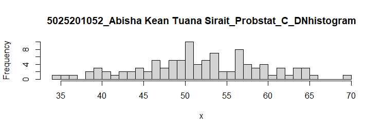

## Soal 1
### Soal 1.a
Distribusi geometrik `G(x, p)` dengan parameter `x` adalah sejumlah n dan parameter `p` adalah nilai probabilitasnya. <br>
Dimana `x = 3` dan `p = 0.20` untuk mendapatkan nilai distribusi geometrik `G(3, 0.2)` dengan bahasa R adalah dengan `dgeom(x, p)`
```
dgeom(x ,p)
```
dan diperoleh hasil `0.1024`<br>


### Soal 1.b
Perhitungan mean distribusi geometrik dengan 10000 data random `n = 10000`, nilai probabilitas `p = 0.20` dan `X = 3` dapat diperoleh dengan dengan menggunakan bahasa R
```
mean(rgeom(n ,p) == x)
```
diperoleh hasil `0.1027`<br>


### Soal 1.c
Hasil yang diperoleh dari soal 1.a merupakan nilai eksaknya yaitu `0.1024` <br>
Sedangkan perolehan pada soal 1.b merupakan hasil perolehan simulasi dengan mengambil 10000 data random untuk kasus yang serupa dengan soal 1.a <br>
Kesimpulan yang dapat diambil adalah hasil yang didapatkan dari percobaan random adalah dekat dengan nilai eksaknya.

### Soal 1.d
Histogram distribusi geometrik, dengan peluang `X = 3` gagal sebelum sukses pertama.<br>
```
library(dplyr)
library(ggplot2)

data.frame(x = 0:10, prob = dgeom(x = 0:10, prob = p)) %>%
  mutate(Failures = ifelse(x == n, n, "other")) %>%
  ggplot(aes(x = factor(x), y = prob, fill = Failures)) +
  geom_col() +
  geom_text(

    aes(label = round(prob,2), y = prob + 0.01),
    position = position_dodge(0.9),
    size = 3,
    vjust = 0
  ) +
  labs(title = "Probability of X = 3 Failures Prior to First Success",
       subtitle = "Geometric(.2)",
       x = "Failures prior to first success (x)",
       y = "Probability")
```
 

### Soal 1.e
nilai rataan atau mean(Mu) pada distribusi geometrik dapat diperoleh dengan `Mu = 1 / p` dimana `p` adalah nilai probabilitasnya.
```
mean = 1 / p
```
untuk `p = 0.20` nilai mean(Mu) adalah `Mu = 5`.<br>

<br>
Nilai Variance pada distribusi geometrik dapat diperoleh dengan

```
variance = (1-p) / p^2
```
dengan `p` merupakan nilai probabilistik dimana untuk nilai `p = 0.20` diperoleh nilai `variansi 20`<br>


## Soal 2
Untuk studi kasus soal 2, karena kondisi yang dapat muncul adalah binary( sembuh, sakit), maka perhitungan dapat dilakukan dengan pendekatan distribusi peluang binomial.<br>
Dengan pasien adalah 20 `n = 20` dan peluang sembuh 0.2 `p = 0.2`
### Soal 2.a
Peluang untuk 4 pasien yang sembuh `x = 4` dapat diperoleh dengan `dbinom(x , n , p)`
```
dbinom(x, n, p)
```
dimana `x = 4` `n = 20` `p = 0.2`
diperoleh hasil `0.2181994` <br>


### Soal 2.b
Histogram kasus soal 2<br>


### Soal 2.c
Nilai rataan(Mu) distribusi binomial adala `Mu = n p`
dalam bahasa R
```
Rataan = n * p
```
dan didapatkan hasil `4` <br>

<br>
Nilai varian distribusi binomial `Varian = n . p . q`
dimana nilai `q = 1 - p`
```
n = 20
p = 0.2
q = 1 - p
varian = n * p * q
varian
```


<br>

## Soal 3
Studi kasus soal 3 dapat diidentifikasi sebagai distribusi peluang poisson
dimana nilai lambdanya 4.5 `lambda = 4.5`
### Soal 3.a
Peluang bahwa 6 bayi akan lahir besok `x = 6`. dapat diperoleh dengan `dpois(x,lambda)`
```
x = 6
lambda = 4.5
dpois(x,lambda)
```

### Soal 3.b
Simulasi pada histogram kelahiran 6 bayi lahir pada rumah sakit terkait selama setahun(n = 365)<br>

### Soal 3.c
Hasil simulasi didapatkan sekitar 11.5% sedangkan
<br> Hasil nilai eksaknya 12.8%
Dapat dikatakan nilai hasil simulasi mendekati atau sebanding dengan hasil eksak.

### Soal 3.d
nilai rataan dan varian dari distribusi poisson adalah nilai lambdanya
```
rataan = lambda
```
```
varian = lambda
```
<br>


## Soal 4
Distribusi probabilitas Chi-square `x = 2` `df = 10`
### Soal 4.a
Fungsi probabilitas Chi-square `C(x, df)`
```
x = 2
df = 10

dchisq(x, df)
```


### Soal 4.b
Simulasi Chi-Square dengan 100 data random
```
p <- rchisq(100,df)

hist(p,
     freq = FALSE,
     xlim = c(0,30),
     ylim = c(0,0.2),
     main = "Histogram Of Chi-Square")

```

### Soal 4.c
nilai rataan pada distribusi peluang Chi-square adalah sebanding dengan df
```
rataan = df
```

<br>
Sedangkan nilai varian distribusi Chi-square 2 kali df<br>

```
varian = 2 * df
```


## Soal 5
Distribusi exponensial dengan `lambda = 3`
### Soal 5.a
Fungsi probabilitas distribusi Eksponensial `E(x, lambda) = lambda * e ^ (-lambda * x)`
```
dexp(x, rate = lambda)
```
Berikut contoh perhitungan dengan nilai x = 100 <br>

### Soal 5.b

Histogram exponensial untuk n = 10
```
set.seed(1)
x1 <- rexp(10,rate = lambda)
hist(x1,
     main = "Histogram Exponensial if n = 10")
```
<br>
Histogram exponensial untuk n = 100
```
set.seed(1)
x2 <- rexp(100,rate = lambda)
hist(x2,
     ylim = c(0,50),
     xlim = c(0,2),
     main = "Histogram Exponensial if n = 100")
```
<br>
Histogram exponensial untuk n = 1000
```
set.seed(1)
x3 <- rexp(1000,rate = lambda)
hist(x3,
     ylim = c(0,500),
     xlim = c(0,3),
     main = "Histogram Exponensial if n = 1000")
```
<br>
Histogram exponensial untuk n = 10000
```
set.seed(1)
x4 <- rexp(10000,rate = lambda)
hist(x4,
     ylim = c(0,5000),
     xlim = c(0,4),
     main = "Histogram Exponensial if n = 10000")
```


### Soal 5.c
distribusi Exponensial dengan `n = 100` `lambda = 3` dapat diperoleh dengan melakukan `rexp(n, rate = lambda)`
<br>
rataan dapat diperoleh dengan fungsi `mean()` dengan parameter distribusi exponensial `data`
```
rataan = mean(data)
```


Varian dapat diperoleh dengan fungsi `var()` dengan parameter distribusi exponensial `data`.
```
Varian = 1 / (lambda)^2
```


## Soal 6
Random generate dengan banyak 100 data `n = 100`, mean 50 `m = 50`, sd 8 `sd = 8`
### Soal 6.a
Perhitungan Z-Score dan plot data pada grafik.<br>
```
data <- rnorm(100,50,8)
rata_rata <- mean(data)
x1 <- floor(mean(data))
x2 <- round(mean(data))

z_scores <- (data - mean(data) / sd(data))

plot(z_scores, type = "l", col="green")
```

### Soal 6.b
Generate histogram dari Distribusi normal dengan breaks 50. <br>
```
x <- rnorm(100,50,8)
hist(x, breaks = 50, main = "5025201052_Abisha Kean Tuana Sirait_Probstat_C_DNhistogram")
```

### Soal 6.c
nilai variansi dari hasil generate random nilai distribusi normal dapat diperoleh dengan
```
var(x)
```

